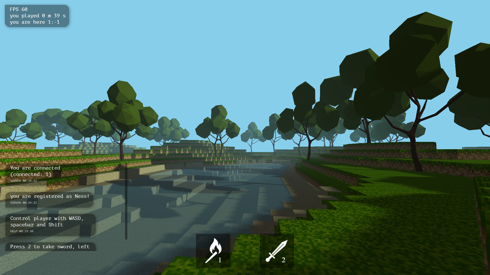

## Rolling Scopes School Minecraft game clone

[Задание](https://github.com/rolling-scopes-school/tasks/blob/master/tasks/rsclone/rsclone.md)

[Приложение](https://rsclone-minecraft.netlify.app)

[Сервер](https://github.com/addamsv/The-Minecraft-Game-Clone/tree/server)

[Статья на Медиуме про проект](https://tatsmaki.medium.com/rs-school-minecraft-на-typescript-aa7f4db88bd5)

[Видео на Ютюб про проект](https://www.youtube.com/watch?v=vuykuEkxEtY)

### Дедлайн 03.02.2021

### Самооценка приложения 620/320 баллов

### Самооценка статьи с обзором видео 160/160 баллов

 

# Список реализованных фич:

## Пользовательский интерфейс 100 баллов

- Есть возможность управления игрой с клавиатуры и с помощью мышки, используются клавиши WASD, 1, 2, Пробел, Shift, Enter (20 баллов)
- Есть возможность переключения английского и русского языков (20 баллов)
- Используется модальный диалог для входа, регистрации, смены пароля на сервере, для выхода из игры (10 баллов)
- Возможность кастомизации настроек угла обзора, дальности видимости (20 баллов)
- С помощью ключевых кадров реализованы анимации появления игровых интерфейсов и меню, анимация перезарядки меча и фонарика, анимация удара мечом (20 баллов)
- Приложения работает на ПК (10 баллов)

## Работа игры 40 баллов

- Расширенные настройки звука, доступна настройка громкости музыки и игровых эффектов, яркости освещения в игре (20 баллов)
- Есть статистика, которая отображает текущую частоту кадров, время с момента начала игры, текущие координаты игрока (20 баллов)

## Технический стек 90 баллов

- Использован Canvas и WebGL, для разработки игры использовался THREE js (20 баллов)
- Работа с Audio API, в игре реализована фоновая музыка, звуки ходьбы по различным поверхностям, звук плавания (10 баллов)
- Использован webpack (10 баллов)
- Сохранение и загрузка настроек пользователя с использование localStorage (10 баллов)
- Приложение/игра написаны на TypeScript (40 баллов)

## Работа с кодом 50 баллов

- При разработке приложения использовался MVC паттерн (20 баллов)
- Использован eslint, eslint-config-airbnb-base (10 баллов)
- Понятный, читаемый код. Имена переменных и функций отражают то что в них содержится/то что они делают. Функция выполняет одно действие. Повторение логики сведено к минимуму. (20 баллов)

## Бекенд 140 баллов

- Использован RESTful API (30 баллов)
- Подключение и работа с БД, postgre (30 баллов)
- Аутентификация (20 баллов)
- Приложение отображает таблицу пользователей со статистикой данные для которых получает от бекенда (20 баллов)
- Реализован nodejs и express, отдаёт корректные ответы, отдаёт HTTP ошибки с нормальными body, по которым можно понять, что произошло, пишет читаемые логи (40 балов)

## Дополнительная функциональность 200/160 баллов

- в игре проработана "физика", игрок испытывает "силу тяжести" и не проваливается через препятствия, звук ходьбы меняется в зависимости от поверхности, на которой находится игрок (40 баллов)
- есть сетевой режим игры в котором видны другие игроки, понятно направление их движения, поворот игровой камеры, доступен общий игровой чат (40 баллов)
- использование websocket для передачи игровых координат и других сообщений в сетевой игре (20 баллов)
- 3d игра (40 баллов)
- генерация бесконечной карты (20 баллов)
- использование webworker для создания игрового мира, схему сообщения между двумя потоками можно посмотреть в статье (20 баллов)
- симуляция дневного цикла, движения источника света по небу, есть рассвет и закат (20 баллов)

## Дополнительная функциональность, которую мы не учитывали, но она появилась в общей таблице

- нарисованные с нуля 3d модели и их анимация
- использование sass
- реализован чат

## Дополнтельно:
### Three.js
Легковесная кроссбраузерная библиотека JavaScript, используемая для создания и отображения анимированной компьютерной 3D графики при разработке веб-приложений.  
Преимущества: библиотека проста для освоения, легко мофицировать трехмерные объекты.
### Typescript
Язык программирования, представленный Microsoft в 2012 году и позиционируемый как средство разработки веб-приложений, расширяющее возможности JavaScript.  
Преимущества: строгая типизация, удобство работы с большим проектом.
### SCSS
Метаязык на основе CSS, предназначенный для увеличения уровня абстракции CSS-кода и упрощения файлов каскадных таблиц стилей.
### MVC
Схема разделения данных приложения, пользовательского интерфейса и управляющей логики на три отдельных компонента: модель, представление и контроллер — таким образом, что модификация каждого компонента может осуществляться независимо.  
Преимущества: удобство работы с модулями приложения.
### SimplexNoise
JavaScript библиотека для создания симплексного шума, похожего на шум Перлина, но с меньшими вычислительными затратами.  
Недостатки: время создания шума, библиотека создает массивы, с которыми сложно работать.
### WebWorker
Cценарий JavaScript, выполняемый из HTML-страницы, работающей в фоновом режиме, независимо от сценариев, которые также могли быть выполнены с той же HTML-страницы.  
Преимущества: позволяет значетельно увеличить отзывчивость приложения.  
Недостатки: скорость запуска скрипта в фоновом потоке.
### Node.js
Программная платформа, основанная на движке V8, превращающая JavaScript из узкоспециализированного языка в язык общего назначения.
### express
Фреймворк web-приложений для Node.js, реализованный как свободное и открытое программное обеспечение под лицензией MIT. Он спроектирован для создания веб-приложений и API. Де-факто является стандартным каркасом для Node.js.
### JWT 
JSON Web Token — это открытый стандарт для создания токенов доступа, основанный на формате JSON. Как правило, используется для передачи данных для аутентификации в клиент-серверных приложениях.
### postgreSQL
Cвободная объектно-реляционная система управления базами данных.
### WebSocket
Протокол связи поверх TCP-соединения, предназначенный для обмена сообщениями между браузером и веб-сервером в режиме реального времени.
