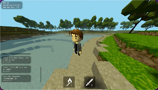
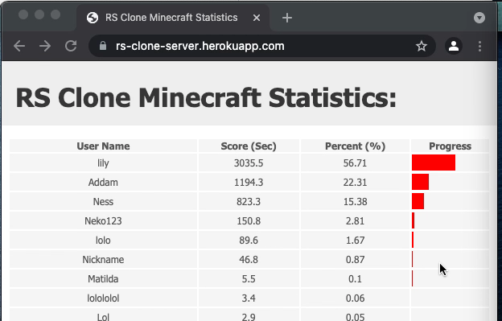

# Mincraft 3D Net Game Сервер статистики

<br>

## Игра по сети

  

<br><br>

## Статистика Игры

  

<br><br>

### Перед запуском убедиться, что база данных Postgres с именем rs-clone-server существует

```sql
create database "rs-clone-server";

create table players (id varchar(255), login varchar(255), password varchar(255));
INSERT INTO players(id, login, password) VALUES ('1', 'admin', '123');

create table tokens (uuid varchar(255), token varchar(255));

create table player_settings (uuid varchar(255));
INSERT INTO player_settings(uuid) VALUES ('1');

create table player_statistics (uuid varchar(255), player_values varchar(255));
INSERT INTO player_statistics(uuid, player_values) VALUES ('1', '12231');
```
